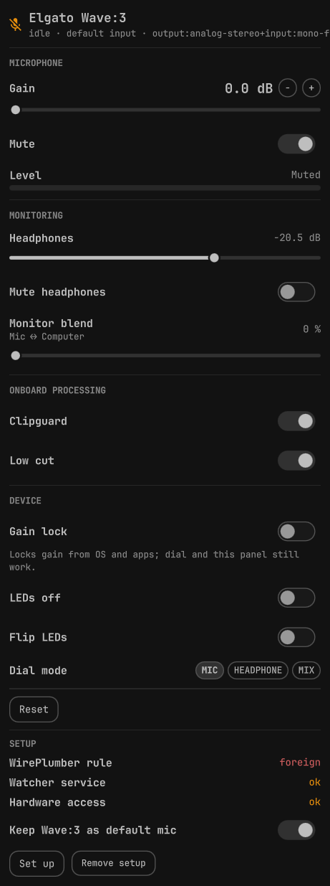

# abduldotdev.wave3

Bar widget and hardware controls for an Elgato Wave:3 USB microphone (`0fd9:0070`) on Omarchy. The icon shows whether the mic is present, default, and muted. The popup drives the vendor features PipeWire cannot reach, and can put your settings back after a replug.



## Disclaimer

This project is not affiliated with or endorsed by Elgato or Corsair. "Elgato" and "Wave:3" are trademarks of Corsair.

Hardware controls use a reverse-engineered USB protocol. Use them at your own risk. There is no warranty.

Tested on one Wave:3 reporting API 5.3. `wave3-hw` accepts 5.3 and 5.4 (5.4 per the upstream protocol notes, untested here) and refuses every other version. No writes happen then.

## Features

The widget works as soon as the plugin is added: status, reset, the popup, and the pactl fallback. WirePlumber rules and the background watcher are not installed until you click **Set up** (or run `wave3-setup install`).

Two separate problems make a plugged-in Wave:3 look dead, and neither is a USB dropout:

1. **Wrong default.** If the configured default source is another mic that is unplugged, WirePlumber falls back by priority. A webcam mic can rank above the Wave:3 and, if that mic is muted, apps record silence.
2. **Stuck suspend.** The Wave:3 input node suspends after a few seconds idle and sometimes does not wake. Switching the card to a digital profile and back to `output:analog-stereo+input:mono-fallback` reopens it.

After setup, the WirePlumber rule raises the Wave:3 above another mic or webcam mic and refuses to suspend it. `wave3-reset` is the profile toggle when the node is still stuck. The watcher puts the mic back as the default when it reappears, unless you turn that off, and restores the hardware settings you saved.

- **WirePlumber rule** (`wireplumber/51-elgato-wave3.conf`): pins the analog profile, sets `priority.session` and `priority.driver` to 3000 on the Wave:3 input, and sets `session.suspend-timeout-seconds` to 0 on its input and output. Matched by name pattern, never by a device identity string or numeric id. WirePlumber reads this the next time it starts.
- **`wave3-reset`**: switches the card to the digital profile and back, waiting after each switch until the source reappears under a new index, then sets the Wave:3 as the default source and unmutes it. Safe to run repeatedly. Exits non-zero with a message on stderr when the mic is not plugged in.
  - `wave3-reset --default-only`: set default and unmute only, without touching the profile. This still forces the Wave:3 when a filter source is the default.
  - `wave3-reset --ensure-default`: like `--default-only`, but a no-op (exit 0, with a message) when the current default is virtual. The watcher uses this. Plain `wave3-reset` and `--default-only` still force the Wave:3.
  - `wave3-reset --status`: prints `present=`, `default=`, `default_virtual=`, `muted=`, `state=`, `profile=`, `source=` lines, then `volume=` (mic percent), `sink=` (headphone output name), `sink_volume=` and `sink_muted=`. `default_virtual=yes` when the current default exists in `pactl list short sources`, does not start with `alsa_input.` or `bluez_input.`, and does not end in `.monitor` (for example `easyeffects_source`). It is `no` for the Wave:3 itself, any other physical input, a monitor, or a default that is not listed. Always exits 0, and prints the absent shape when the mic or the audio server is missing. The sink keys are filled whenever the headphone output exists, even without the mic.
- **`wave3-hw`**: reads and writes the vendor control block over USB (API 5.3 or 5.4). Python 3, standard library only. The widget runs `bin/wave3-hw` from the plugin directory.
  - `wave3-hw status`: always exits 0. Prints `present=yes|no`, `access=ok|denied|` (empty when the device is absent), `device=`, `api=` (empty unless `access=ok`) and `supported=yes|no` (`yes` only for API 5.3 or 5.4). When `access=ok` it also prints `gain_db=`, `mute=`, `clipguard=`, `lowcut=`, `hp_db=`, `hp_mute=`, `direct_monitor=`, `volume_select=`, `leds_off=`, `leds_flip=`, `gain_lock=` and `raw=`. Decibel values use one decimal (`10.0`, `-20.5`); `direct_monitor` is an integer percent. It reads under the device lock. When the lock is still held after 2 s, or the USB node keeps answering `EBUSY`/`EAGAIN` (each USB operation is retried with backoff for about 1 s), the output is the single line `error=busy`. Any other unexpected error prints the single line `error=<one line>`. No field lines are printed before an `error=` line, and it still exits 0.
  - `wave3-hw set <field> <value>`: every field above except `raw`. Booleans accept `0`, `1`, `on`, `off`, `yes`, `no`, `true`, `false`. `volume_select` also accepts `mic`, `headphone`, `mix` (stored as 1, 2, 3). Numbers are clamped and rounded to the step: gain 0–40 dB by 0.5, headphones −60–0 dB by 0.5, monitor blend 0–100 by 5. Refuses to write unless the API version is 5.3 or 5.4. Reads the whole block, changes only the target bytes, writes it back and fails if the read-back differs. Concurrent calls take turns on a lock file. Success prints `<field>=<stored value>`, then one `saved=` line, and exits 0:
    - `saved=yes`: the value read back from the device was recorded in the settings store (see [Remembered settings](#remembered-settings)).
    - `saved=no`: the field is never stored (`mute`, `volume_select`).
    - `saved=error`: the device took the value but the store could not be written. stderr says `wave3-hw: could not save setting: <reason>`.

    A failed write leaves the store alone and prints no `saved=` line.
  - `wave3-hw apply [--settle SECONDS] [--retries N]`: writes the stored settings back to the device. It reads the block, re-encodes only the stored fields that differ, writes once and verifies the read-back. Nothing is written when everything already matches. With `--retries N` it then sleeps `SECONDS` (outside the lock) and checks again `N` times, fixing any drift each round. `--settle` is 0–30 (default 0), `--retries` 0–10 (default 0); `--flag value` and `--flag=value` both work. Output:

    ```
    store=ok|missing|corrupt
    changed=<fields written by the first attempt>
    reapplied=<fields written by later rounds>
    result=applied|noop|absent|denied|unsupported|mismatch|busy|error
    ```

    A missing store (or one with no usable fields) is `result=noop`, exit 0, and the device is not opened. The result and exit code come from the last round. Each failed round adds a `wave3-hw: apply attempt <i>: <reason>` line on stderr. `apply` never writes the store.
  - `wave3-hw save`: reads the device and replaces the store with its current values for every stored field. Prints one `<field>=<value>` line per field, then `saved=yes`.
  - `wave3-hw forget`: deletes the store. Prints `forgotten=yes`, or `forgotten=no` when there was none. It does not open the device, so it works with the mic unplugged.
  - Exit codes: `0` ok, `2` usage / bad field / bad value, `3` device absent, `4` permission denied (stderr names the udev command), `5` unsupported API version, `6` read-back mismatch, `7` settings store corrupt (`apply` only), `8` device busy (lock wait over 2 s, or `EBUSY`/`EAGAIN` retries exhausted), `1` anything else. Every command, `status` and `forget` included, takes the same lock at `$XDG_RUNTIME_DIR/wave3-hw.lock`. The message is `wave3-hw: <text>` on stderr.
  - Tests set `WAVE3_HW_FAKE=<dir>` and never open a USB device. A missing directory means absent; `<dir>/denied` means permission denied; `<dir>/version` is the API text (`5.3` when the file is missing); `<dir>/config` is 16 hex bytes separated by spaces. `<dir>/readonly` drops writes so a read-back mismatch can be tested. `<dir>/busy` holds a count of operations that fail with `EBUSY`; `<dir>/drift` replaces `config` on the second read after the first write (a late OS volume write); each write appends a line to `<dir>/writes`. `device=` then prints `fake:<dir>`.
- **Level meter**: native PipeWire peak monitor (`PwNodePeakMonitor`) tracking the Wave:3 input node directly. While the popup is open and the mic is present, the meter adds a Quickshell peak-monitor stream on the Wave:3 input (visible in `pactl list source-outputs`, and it may light a mic-in-use indicator). It stops when the popup closes or is hidden. The meter is a per-quantum (~47 Hz) dBFS level with a 1.5 s peak hold. It measures the recorded signal, after gain.
- **`wave3-watch`**: user service started by Set up. Listens to `pactl subscribe` and, unless `keep_default=no`, runs `wave3-reset --ensure-default` once at start and whenever a source or card is added. It only reacts to `new` events, so the `change` events from setting the default never retrigger it. When `keep_default=no` it logs `wave3-watch: keep_default=no, leaving the default source alone` and still runs the hardware apply below.
  - At the same moments it runs `wave3-hw apply --settle 2.5 --retries 2` in the background, from its own directory (or `$WAVE3_HW`). That is an immediate apply plus checks at about +2.5 s and +5 s, which put the settings back if the ALSA/WirePlumber volume restore lands after the card appears. After the last check, later OS volume changes are left alone.
  - A new apply is skipped while one is still running, or within `WAVE3_APPLY_INTERVAL` seconds (default 5, `0` turns off only this window) of the previous one's start. Skipped events are dropped, not queued; the running apply's later checks cover the burst of events one replug produces.
  - Each apply logs one journal line when it finishes, for example `wave3-watch: apply rc=0 store=ok changed=gain_db,lowcut,gain_lock reapplied= result=applied`. `wave3-hw`'s own stderr goes to the journal too. A failed or missing `wave3-hw` never stops the watcher or the default-source reset.
  - EasyEffects and other filter sources are chosen on purpose, so the watcher leaves the default alone when it is virtual (`easyeffects_source`, or any listed source that is not `alsa_input.*`, `bluez_input.*` or a `.monitor`). It re-asserts the Wave:3 when the default is missing or not in the source list (another mic that is unplugged), when it is a physical input such as a webcam mic, or when it is a `.monitor`. With **Keep Wave:3 as default mic** off, it leaves the default source alone in every case. Right-click reset still runs plain `wave3-reset` and forces the raw Wave:3.
- **Bar widget**: a microphone icon, dimmed when the Wave:3 is absent and in the warning colour when it is not the default or is muted. A filter source (`default_virtual=yes`) is not that warning. The tooltip shows the state. Left click opens the controls popup, right click runs `wave3-reset`. On a machine with more than one bar, only one of them polls. See [Configuration](#configuration).
- **Controls popup**: state line (connected, default input, profile). When `default_virtual=yes` the state line says the default is a filter source (for example EasyEffects). Hardware mode is `wave3-hw status` reporting `present=yes`, `access=ok` and `supported=yes`. Sections:
  - **MICROPHONE**: hardware gain, 0–40 dB in 0.5 dB steps, with a large dB readout and −/+ buttons, plus mute (hardware `mute`) and the live peak meter.
  - **MONITORING**: headphone level in dB, −60–0 (hardware `hp_db`), with mute (`hp_mute`); monitor blend, Mic ↔ Computer (`direct_monitor`, 0 is all mic and 100 is all computer).
  - **ONBOARD PROCESSING**: Clipguard and Low cut toggles.
  - **DEVICE**: Gain lock, with a one-line note that while it is on the OS and apps cannot change the gain (the knob and this panel still can); LEDs off, flip LEDs, and dial mode (`volume_select`: mic, headphone, mix).
  - **SETUP**: WirePlumber rule, watcher service, and hardware access, plus Set up, Remove setup, and the keep-default toggle. See [Installation](#installation) and [Usage](#usage).

  Without hardware access the popup shows the udev install command, then the pactl mute and headphone controls as a fallback. There is no gain slider in that case. The bar icon, right-click reset, IPC and the meter (only while the popup is open and the mic is present) stay available. Hardware writes go through one process at a time. Sliders send at most one change every 150 ms while dragging, keep the latest value per field, and apply the final value on release. A failed write shows its stderr line briefly and status is read again. After a write that was recorded (`saved=yes`) the popup shows `Saved · restores on reconnect` for 4 s; `saved=error` shows `Changed, but could not save it for reconnect`. Status is re-read every 3 s while the popup is open, but not while you drag a slider, and hardware status is never read while a write is queued or running. An `error=busy` (or other `error=`) read keeps the last good hardware state on screen instead of dropping to the setup view; only `present=no`, `access=denied`, `supported=no` or a good read changes the mode. The SETUP block is read when the popup opens and after a setup action, not on that timer.
- **IPC**: `omarchy-shell abduldotdev.wave3 open|close|toggle|reset|refresh`. With several bars, only the leader handles these. See [Configuration](#configuration).

### Wave Link features on Linux

| Feature | Mark | Reason |
|---|---|---|
| Gain | supported-hardware | Vendor control protocol, `gain_db` 0–40 dB in 0.5 steps |
| Mute | supported-hardware | Vendor control protocol, `mute` |
| Headphone level | supported-hardware | Vendor control protocol, `hp_db` −60–0 dB and `hp_mute` |
| Clipguard | supported-hardware | Vendor control protocol, `clipguard` |
| Low cut | supported-hardware | Vendor control protocol, `lowcut` |
| Mic/PC mix (monitor blend) | supported-hardware | Vendor control protocol, `direct_monitor` (0 = all mic, 100 = all computer) |
| LEDs | supported-hardware | Vendor control protocol, `leds_off` and `leds_flip` |
| Gain lock | supported-hardware | Vendor control protocol, `gain_lock` |
| Dial mode | supported-hardware | Vendor control protocol, `volume_select` (mic / headphone / mix) |

`wave3-hw` speaks the protocol documented by [elgato-wave3-ubuntu](https://github.com/KailasMahavarkar/elgato-wave3-ubuntu) (MIT). Capture and playback stay on `snd-usb-audio`. The tool only opens the USB device node to read and write the control block.

**Gain lock:** while gain lock is on, the firmware ignores OS volume changes. The knob and `wave3-hw set gain_db` still change the gain. Turn gain lock off when an app should control the level.

### Remembered settings

The Wave:3 keeps its settings in volatile memory. After a replug or reboot it comes up with its own defaults (for example gain 40 dB, low cut and gain lock off). This plugin stores your choices and restores them when the watcher is running.

- **Store:** `$XDG_STATE_HOME/abduldotdev.wave3/hw.json`, which is `~/.local/state/abduldotdev.wave3/hw.json` when `XDG_STATE_HOME` is unset. `WAVE3_HW_STORE=<path>` overrides it. The directory is created `0700` and the file written `0600`, through a temporary file and a rename, so it is never half-written.
- **What is recorded:** every successful `wave3-hw set` (and so every hardware change in the popup) of `gain_db`, `clipguard`, `lowcut`, `hp_db`, `hp_mute`, `direct_monitor`, `leds_off`, `leds_flip` or `gain_lock`. Only fields you have set are stored. `wave3-hw save` stores the device's current values for all of them at once; `wave3-hw forget` deletes the store. Nothing records the device state on its own, so power-on defaults never overwrite your choices. The store is written when you change a control, which can be before Set up if the udev rule is already installed.
- **When it is restored:** `wave3-watch` runs `wave3-hw apply` when it starts and when the mic reappears. With `gain_lock` stored as on, the first write sets the lock together with the gain, so the OS volume restore is ignored by the firmware. The watcher exists only after Set up.
- **Mute is not restored.** A mic that comes back muted is easy to miss in a call, so hardware `mute` is never stored (`set mute` prints `saved=no`).
- **Dial mode (`volume_select`) is not restored.** The device changes it on its own, so a restored value would not stay and would fight the knob. `set volume_select` prints `saved=no`, and `apply` never writes it.
- **Corrupt store:** `apply` prints `store=corrupt` and exits 7 without touching the device. The next `set` or `save` replaces it with a fresh store and says so on stderr; `forget` removes it. A single invalid value is skipped with a `wave3-hw: store: ignoring <field>` line while the rest apply.

### EasyEffects

Pick the Wave:3 as EasyEffects' input, then select `easyeffects_source` as the default source. `wave3-watch` treats that name as a virtual source and leaves it alone, including when **Keep Wave:3 as default mic** is on. If Clipguard or Low cut is on in hardware, turn EasyEffects' limiter or high-pass off so the signal is not processed twice. Right-click reset (and `wave3-reset` / `--default-only`) still forces the raw Wave:3, past the filter. Other EasyEffects plugins, such as noise reduction, can stay on.

## Requirements

| Dependency | Used for |
|---|---|
| Omarchy 4 with omarchy-shell | Bar widget, popup, IPC |
| `pactl` (libpulse) | Default source, volumes, the watcher subscription |
| `awk` | Parsing `pactl` output in `wave3-reset` |
| Python 3 standard library | `wave3-hw` (no third-party packages) |
| WirePlumber 0.5 | Drop-in rule, after you click Set up |
| systemd user session | `wave3-watch.service`, after you click Set up |

`jq` is not used.

`omarchy plugin add` only clones the repository into `~/.config/omarchy/plugins/abduldotdev.wave3` and validates it. It does not run plugin code, install hooks, or sudo.

## Installation

```bash
omarchy plugin add https://github.com/abduldotdev/wave3 --enable
```

The bar icon works immediately: status, left-click popup, right-click reset, and the pactl fallback when the USB control node is not readable. Nothing is written under your home directory until you use a control: Set up writes the drop-in and unit, the keep-default toggle writes `~/.config/abduldotdev.wave3/config`, and hardware changes are remembered in `~/.local/state/abduldotdev.wave3/hw.json`. (`omarchy plugin add` itself creates the plugin folder.)

Open the popup and use **SETUP**, or run the same steps from a terminal. The script is `~/.config/omarchy/plugins/abduldotdev.wave3/bin/wave3-setup`. It never runs sudo, never restarts PipeWire or WirePlumber, and never changes volumes or the default source.

**Set up** (or `wave3-setup install`) is idempotent. It creates only:

1. A symlink `~/.config/wireplumber/wireplumber.conf.d/51-elgato-wave3.conf` pointing at this plugin's `wireplumber/51-elgato-wave3.conf`. `$XDG_CONFIG_HOME` is honoured when it is set.
2. A generated user unit `~/.config/systemd/user/wave3-watch.service`, marked `# Managed by abduldotdev.wave3 wave3-setup`, with `ExecStart` set to this plugin's `bin/wave3-watch` and `ConditionPathExists` on that binary. It then runs `systemctl --user daemon-reload` and `systemctl --user enable --now wave3-watch.service`.

It does not write the keep-default config, does not install the udev rule, and does not link anything into `~/.local/bin`.

If either path already belongs to this plugin, it is left as it is (`ok: … already installed`). That includes a symlink whose target is byte-identical to the plugin's WirePlumber file. The user unit belongs to the plugin only when its whole content (the file itself, or the file a symlink resolves to) is byte-identical to the unit install generates for this plugin directory, or to the shipped `systemd/wave3-watch.service`, which runs `%h/.config/omarchy/plugins/abduldotdev.wave3/bin/wave3-watch`. The managed-by marker line alone does not count, so a unit with an edited or different `ExecStart` is foreign: it is never enabled, disabled or removed. Anything else at either path is foreign: install prints `wave3-setup: skip (not ours): <path>` on stderr, continues with the other item, and exits 1. It does not overwrite or delete that file.

WirePlumber reads a new drop-in the next time it starts. Restart it yourself with `systemctl --user restart wireplumber`, or log in again. Restarting WirePlumber drops open audio streams. The plugin never runs that restart. Until then the priority and suspend rules are not in effect; `wave3-reset` still works.

Hardware controls need one sudo step, and only if `udev=missing`. The rule tags USB `0fd9:0070` with `uaccess` for the logged-in seat user so `wave3-hw` can open the device node. It does not detach `snd-usb-audio` or claim an interface. Capture and playback stay with the kernel driver. Set up prints the command and does not run it. The popup shows the same text, selectable, when hardware access is missing:

```bash
sudo install -m644 ~/.config/omarchy/plugins/abduldotdev.wave3/udev/70-elgato-wave3.rules /etc/udev/rules.d/ && sudo udevadm control --reload && sudo udevadm trigger
```

`wave3-setup status` always exits 0 and prints these keys, in this order:

| Key | Values |
|---|---|
| `wireplumber` | `installed` if `~/.config/wireplumber/wireplumber.conf.d/51-elgato-wave3.conf` is a symlink to this plugin's file, or a symlink to a byte-identical file. `foreign` if something else is there. `missing` otherwise. |
| `service` | `installed` if the user unit's full content is byte-identical to the generated unit or to this plugin's `systemd/wave3-watch.service` (directly or through a symlink). `foreign` if something else is there, including a unit with the marker line but different content. `missing` otherwise. |
| `service_enabled` | `yes` or `no`, from `systemctl --user is-enabled wave3-watch.service`. Any failure is `no`. |
| `service_active` | `yes` or `no`, from `systemctl --user is-active wave3-watch.service`. Any failure is `no`. |
| `udev` | `installed` if `70-elgato-wave3.rules` exists under `/etc/udev/rules.d`, `/run/udev/rules.d`, or `/usr/lib/udev/rules.d`. Otherwise `missing`. |
| `keep_default` | `yes` or `no`. Missing file or key is `yes`. |
| `setup` | `complete` when wireplumber is `installed`, service is `installed`, service is enabled, and udev is `installed`. `none` when wireplumber and service are both `missing`. Otherwise `partial`. |
| `plugin_dir` | Resolved plugin directory. |
| `udev_command` | The sudo install command above, with the resolved plugin path single-quoted. |

`WAVE3_SYSTEMCTL` overrides the `systemctl` binary. `WAVE3_UDEV_RULES_DIRS` overrides the udev search path. Both exist so tests can stub them.

## Usage

- **Left click** the bar icon opens the popup. Left click again closes it.
- **Right click** runs `wave3-reset` (profile toggle, then force the Wave:3 as the unmuted default). This still forces the mic when the default is a filter source, and when **Keep Wave:3 as default mic** is off.
- **Popup.** State line, then MICROPHONE, MONITORING, ONBOARD PROCESSING, DEVICE, and SETUP. Sliders and toggles in the first four sections call `wave3-hw` when hardware access works, and pactl for mute and headphone level when it does not.
- **SETUP** is hidden when `bin/wave3-setup` is missing or its output is not the status block. Otherwise it shows three rows: WirePlumber rule, Watcher service (installed, enabled, and active), Hardware access (udev). Each row is ok or a missing/foreign/disabled/inactive mark.
  - **Set up** is shown when `setup` is not `complete`. It runs `wave3-setup install`, then reads status again. One line of the result is shown briefly.
  - When udev is missing, the `udev_command` is shown as selectable text with the note that this is the step that needs sudo. Nothing runs it for you.
  - **Remove setup** is shown when anything is installed. The first click arms it; a second click within 3 seconds runs `wave3-setup uninstall`. The label reads **Confirm remove** while it is armed.
  - **Keep Wave:3 as default mic** runs `wave3-setup keep-default on` or `off`.
- **IPC**, handled once (by the leader bar):

```bash
omarchy-shell abduldotdev.wave3 open
omarchy-shell abduldotdev.wave3 close
omarchy-shell abduldotdev.wave3 toggle
omarchy-shell abduldotdev.wave3 reset
omarchy-shell abduldotdev.wave3 refresh
```

## Configuration

**Keep Wave:3 as default mic** is the `keep_default` key in `$XDG_CONFIG_HOME/abduldotdev.wave3/config` (`~/.config/abduldotdev.wave3/config` when `XDG_CONFIG_HOME` is unset). The file is `key=value` lines. The toggle and `wave3-setup keep-default on|off` rewrite that key and preserve every other line.

Missing file or missing key means `keep_default=yes`. The watcher only exists after you opt in with Set up, and the point of that watcher is to keep the Wave:3 as the default, so the default is on. Set it to `no` and the watcher still restores hardware settings on start and on replug, but it leaves the default source alone. Right-click reset still forces the Wave:3. The watcher reads the file on every trigger, so the toggle applies without restarting the service.

`WAVE3_CONFIG` overrides the config path (used by tests).

**One bar polls.** Omarchy creates one widget instance per bar, one per monitor. A shared registry elects the first live instance as leader. Only the leader runs the background poll: `wave3-reset --status` every 10 s, and `wave3-hw status` at most every 30 s. The other bars receive the same parsed state. If the leader is destroyed, the next live bar takes over. While a popup is open, that bar does the 3 s poll and the hardware writes, and publishes the results so every bar stays in sync. Setup status is not polled; it is read when the popup opens and after a setup action.

Quickshell keeps a single IPC handler per target. Only the leader registers `abduldotdev.wave3`, so `open`, `close`, `toggle`, `reset`, and `refresh` run once, not once per monitor.

## Permissions and files touched

Nothing in this table is created by `omarchy plugin add` except the plugin directory itself. Set up is the explicit consent for the WirePlumber drop-in and the user service.

| Path | Who writes it | Background process |
|---|---|---|
| `~/.config/omarchy/plugins/abduldotdev.wave3/` | `omarchy plugin add` (a git clone). Plugin code does not write here. | omarchy-shell loads `Widget.qml`. One leader bar polls `bin/wave3-reset` and `bin/wave3-hw`. An open popup adds a PipeWire peak-monitor source-output until it closes. |
| `~/.config/wireplumber/wireplumber.conf.d/51-elgato-wave3.conf` | `wave3-setup install` (symlink). Removed by `wave3-setup uninstall` only if it points at this plugin. | None. WirePlumber applies it on its next start, which you run. |
| `~/.config/systemd/user/wave3-watch.service` | `wave3-setup install` (generated unit, then `enable --now`). Removed by uninstall only when its full content is that generated unit or the shipped unit (see [Installation](#installation)). | `wave3-watch` (systemd user service): `pactl subscribe`, `wave3-reset --ensure-default` unless `keep_default=no`, and `wave3-hw apply`. |
| `/etc/udev/rules.d/70-elgato-wave3.rules` | You, with the sudo command from `udev_command`. The plugin never writes it. | None from this plugin. |
| `~/.config/abduldotdev.wave3/config` | The keep-default toggle, or `wave3-setup keep-default`. Not written by install or uninstall. | `wave3-watch` reads `keep_default` on each trigger. |
| `~/.local/state/abduldotdev.wave3/hw.json` | `wave3-hw set` and `wave3-hw save` (popup hardware changes). Mode `0600`. | `wave3-watch` runs `wave3-hw apply` to restore it. Uninstall does not delete it. |
| `$XDG_RUNTIME_DIR/wave3-hw.lock` | `wave3-hw`, while a command holds the device lock. | The command that took the lock. |

`wave3-setup` refuses to replace a foreign file at the WirePlumber or unit path. It never touches the settings store or the keep-default config on uninstall.

## Uninstall

Run **Remove setup** (second click within 3 seconds) or `wave3-setup uninstall` **before** `omarchy plugin remove`. `omarchy plugin remove` only deletes the plugin folder. It does not remove the WirePlumber symlink or the user unit. The generated unit's `ConditionPathExists` means the service will not start once `bin/wave3-watch` is gone, but the unit and the drop-in would be left behind.

```bash
~/.config/omarchy/plugins/abduldotdev.wave3/bin/wave3-setup uninstall
omarchy plugin remove abduldotdev.wave3
```

Uninstall disables and stops `wave3-watch.service` when the unit is one this plugin installed, deletes that unit (only when its full content, directly or through a symlink, is the generated or shipped unit; a unit that merely carries the marker line is foreign), deletes the WirePlumber symlink when it resolves into the plugin (including a byte-identical target), and runs `systemctl --user daemon-reload`. A second run exits 0 and prints `nothing to remove`. Foreign files are left in place. The settings store and `~/.config/abduldotdev.wave3` are left in place.

If `udev=installed`, uninstall prints this and does not run it:

```bash
sudo rm -f /etc/udev/rules.d/70-elgato-wave3.rules && sudo udevadm control --reload && sudo udevadm trigger
```

To drop remembered settings and the keep-default choice as well:

```bash
rm -rf ~/.local/state/abduldotdev.wave3 ~/.config/abduldotdev.wave3
```

The default source the plugin set stays in WirePlumber's normal state until you pick another one. Restart WirePlumber yourself if you want the priority rule to drop before the next login.

## Known limitations

- One Wave:3 at a time. The card and source are the first name that matches `alsa_card.usb-Elgato_Systems_Elgato_Wave_3` / `alsa_input.usb-Elgato_Systems_Elgato_Wave_3`.
- API 5.3 is tested. API 5.4 is accepted from the upstream protocol notes and is untested here. Any other version is refused and nothing is written.
- While the popup is open and the mic is present, the level meter adds a source-output on the Wave:3. That can light a mic-in-use indicator. It is removed when the popup closes.
- WirePlumber does not pick up the new rule until it restarts or you log in again. Restarting it drops open audio streams.
- The udev rule is a manual sudo step. Without it, hardware controls fall back to pactl mute and headphone level.
- Mute and dial mode are never restored. Hardware mute can still be on from the device's own default.
- The watcher will not follow the mic across a virtual default such as EasyEffects. That is intentional. Right-click reset opts out of it for one action.

## Troubleshooting

- **Mic records silence.** Right-click the bar icon, or run `wave3-reset`. It reopens the input with the profile toggle. If the default is another mic or a webcam mic, check that Set up has been run and that WirePlumber has started since the drop-in was linked.
- **Default keeps returning to another mic.** `wpctl inspect` on the Wave:3 input should show `priority.session` 3000. If not, the drop-in is missing or WirePlumber has not been restarted. If the priority is 3000 and the watcher is active, the other device is winning only when **Keep Wave:3 as default mic** is off, or the current default is a virtual filter source.
- **Settings reset after replug.** `systemctl --user status wave3-watch` should be active. `journalctl --user -u wave3-watch` should show `wave3-watch: apply rc=0 … result=applied` or `result=noop` after the replug. `store=missing` means nothing was recorded yet: move a control in the popup, or run `wave3-hw save`. `result=denied` means the udev rule is missing. `store=corrupt` means `hw.json` is unreadable; run `wave3-hw save` to replace it. Mute and dial mode are never restored.
- **Profile is not analog after replug.** WirePlumber prefers the profile stored in `~/.local/state/wireplumber/default-profile` over `device.profile`. `wave3-reset` ends on the analog profile, which WirePlumber then stores as the user choice.
- **Set up says skip (not ours).** A file is already at the WirePlumber or unit path and it is not this plugin's symlink or generated unit. Move that file aside yourself if you want Set up to replace it. Uninstall will not delete it.
- **Hardware rows missing, pactl sliders shown.** `wave3-hw status` reports `access=denied` or `supported=no`, or the device is absent. Install the udev rule for `access=denied`. An unsupported API version is refused with no writes.

## Verification

```bash
# The Wave:3 Mono source is marked * (default) under Audio > Sources
wpctl status

# priority.session / priority.driver = 3000, session.suspend-timeout-seconds = 0
# (after WirePlumber has started with the drop-in loaded)
wpctl inspect <id of "Elgato Wave 3 Mono">

# What the widget sees
~/.config/omarchy/plugins/abduldotdev.wave3/bin/wave3-reset --status

# Setup state
~/.config/omarchy/plugins/abduldotdev.wave3/bin/wave3-setup status

# Watcher, after Set up
systemctl --user status wave3-watch

# WirePlumber while replugging the mic
journalctl --user -u wireplumber -f
```

The config syntax can be checked without touching the running daemon:

```bash
spa-json-dump wireplumber/51-elgato-wave3.conf
```

WirePlumber has no dry-run mode. After a restart, `journalctl --user -u wireplumber` shows any rule it could not parse.

## Testing

The suites use fixtures, a stub `pactl` on `PATH`, or `WAVE3_HW_FAKE`. They do not touch the real audio server, the USB device, or your settings store. The Python suite sets `WAVE3_HW_STORE` to a temporary file.

```bash
node --test tests/
bash tests/scripts.test.sh
python3 -m unittest discover -s tests -p 'test_*.py'
```

`tests/live-hw.sh` is the live check, run by hand after the udev rule is installed. For each of `clipguard`, `lowcut`, `gain_lock`, `direct_monitor` and `gain_db` it writes the current value, changes it, reads it back and restores the original. The same script runs against `WAVE3_HW_FAKE`. When `WAVE3_HW_STORE` is unset it points it at a temporary file for the run, so the test values are not recorded as your settings.

Lint the QML with Qt 6 `qmllint` (the Qt 5 `/usr/bin/qmllint` rejects the `: void` IPC annotations). Warnings about unresolved `qs.*` and Quickshell imports are expected, because those modules only exist inside the shell:

```bash
/usr/lib/qt6/bin/qmllint Widget.qml
/usr/lib/qt6/bin/qmllint Wave3Popup.qml
omarchy plugin validate "$PWD"
```

## Credits

The vendor control protocol is from [elgato-wave3-ubuntu](https://github.com/KailasMahavarkar/elgato-wave3-ubuntu) by KailasMahavarkar, MIT.

## License

MIT. See [LICENSE](LICENSE).
